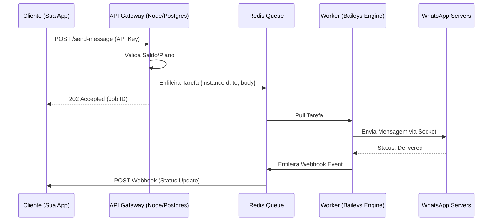

# 🚀 Plano Maestro: ZapQR Cloud SaaS Provider

Este documento detalha a arquitetura definitiva para o provedor SaaS ZapQR, focado em alta disponibilidade, escalabilidade e performance.

## 🏗️ Arquitetura Expandida: ZapQR Cloud

### 1. Camada de Persistência de Sessão (Shared Session Store)
*   **Problema**: Sessões em arquivos locais são frágeis e dificultam o uso de Docker/Containers.
*   **Solução**: Implementar um adaptador para salvar o `auth state` diretamente no **PostgreSQL (JSONB)** ou **Redis**.
*   **Vantagem**: Recuperação instantânea de sessões em qualquer Worker do cluster.

### 2. Camada de Webhooks (Reliable Event Delivery)
*   **Tecnologia**: **BullMQ (Redis)**.
*   **Fluxo**: Worker -> Redis -> Webhook Dispatcher -> Cliente.
*   **Recursos**: Política de retentativa (Retry), backoff exponencial e monitoramento de falhas de entrega.

---

## 🚀 Roadmap Detalhado

### Fase 1: O "Engine" Robusto (Mês 1)
*   **Multi-Instance Manager**: Classe centralizada para gerenciar Connect, Disconnect, Logout e HealthCheck.
*   **API Gateway Inicial**: Rotas de conexão, status e geração de QR Code em Base64.
*   **Session Database**: Migração do `creds.json` para o banco de dados.

### Fase 2: O Ecossistema SaaS (Mês 2)
*   **Auth & Rate Limiting**: Gestão de API Keys e limites por plano (Free/Pro) via Redis.
*   **Dashboard Next.js**: Interface para o cliente monitorar instâncias e configurar Webhooks.

### Fase 3: O Diferencial (The "Z-API Killer")
*   **PIX Checkout Nativo**: Integração direta com gateways (Mercado Pago/Asaas).
*   **Templates de Interação**: Helpers simplificados para Carrosséis, Listas e Botões.

### Fase 4: Observabilidade e Segurança (Mês 3)
*   **Logs Centralizados**: Debugging de mensagens para o cliente final.
*   **Isolamento por Docker**: Clusterização de instâncias em containers separados.

---

## 📊 Fluxograma de Operação

## 🛠️ Stack Tecnológica Recomendada
| Componente | Tecnologia | Rationale |
| :--- | :--- | :--- |
| **Banco de Dados** | PostgreSQL | Robustez transacional e JSONB para sessões. |
| **Fila/Cache** | Redis + BullMQ | Alta performance e gestão de retentativas. |
| **Infra** | Docker + Traefik | Roteamento fácil e escalabilidade horizontal. |
| **Monitoramento** | Prometheus + Grafana | Visibilidade total de throughput e erros. |
